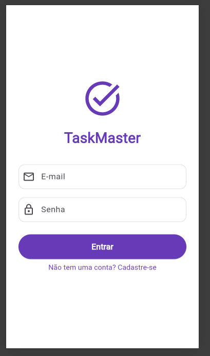
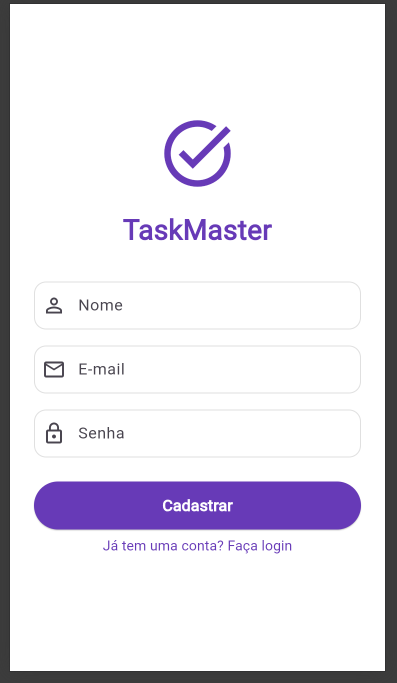
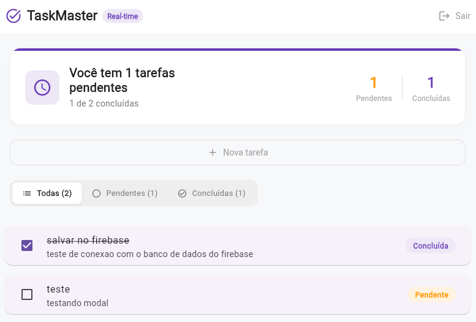
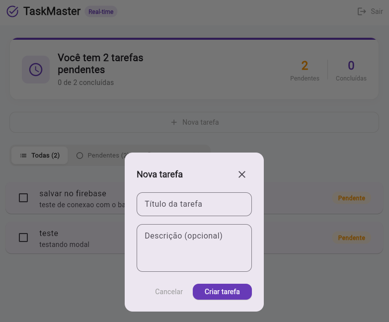

# Flutter Task Master

Um aplicativo Flutter moderno para gerenciamento de tarefas com autenticação Firebase e armazenamento em tempo real. Organize suas tarefas de forma eficiente com uma interface intuitiva e responsiva.

## 📋 Funcionalidades

- ✅ **Autenticação Firebase**: Login e registro seguro com Firebase Authentication
- 📝 **Gerenciamento de Tarefas**: Criar, editar, visualizar e deletar tarefas
- ☁️ **Sincronização em Tempo Real**: Dados sincronizados em tempo real com Firestore
- 👤 **Perfil de Usuário**: Gerenciamento de dados do usuário
- 🎨 **Interface Responsiva**: Design limpo e intuitivo com Material Design 3
- 📱 **Multiplataforma**: Disponível para iOS, Android, Web, Windows, macOS e Linux

## 🚀 Começando

### Pré-requisitos

- Flutter SDK 3.11.4 ou superior
- Dart 3.11.4 ou superior
- Firebase CLI instalado
- Uma conta Firebase
- IDE: VS Code, Android Studio ou IntelliJ IDEA

### Instalação

1. **Clone o repositório**
   ```bash
   git clone https://github.com/Rafaela-Quinzel/flutter-task-master.git
   cd flutter_task_master
   ```

2. **Instale as dependências**
   ```bash
   flutter pub get
   ```

3. **Configure o Firebase**
   ```bash
   firebase login
   flutterfire configure
   ```

4. **Execute o aplicativo**
   ```bash
   flutter run
   ```

## 📁 Estrutura do Projeto

```
lib/
├── main.dart                 # Ponto de entrada da aplicação
├── config/
│   └── firebase_config.dart  # Configuração do Firebase
├── controllers/
│   └── auth_controller.dart  # Lógica de autenticação
├── helpers/
│   └── auth_helper.dart      # Funções auxiliares de autenticação
├── models/
│   └── task_model.dart       # Modelo de dados das tarefas
├── screens/
│   ├── auth/                 # Telas de autenticação
│   └── task_list/            # Telas de gerenciamento de tarefas
├── services/
│   └── auth.service.dart     # Serviços de autenticação
└── widgets/
    └── custom_text_field.dart # Widgets customizados
```

## 📦 Dependências Principais

- **firebase_core**: Inicialização do Firebase
- **firebase_auth**: Autenticação de usuários
- **cloud_firestore**: Banco de dados em tempo real
- **provider**: Gerenciamento de estado
- **flutter_lints**: Análise estática de código

## 🎨 Screenshots

Veja algumas telas do aplicativo:

### Tela de Login


### Tela de Registro


### Lista de Tarefas


### Nova Tarefa


## 🔧 Como Usar

### Autenticar um Usuário
```dart
// Usar AuthController para login
await authController.login(email, password);
```

### Criar uma Tarefa
```dart
// Adicionar nova tarefa ao Firestore
Task newTask = Task(
  id: DateTime.now().toString(),
  title: 'Minha tarefa',
  description: 'Descrição da tarefa',
  completed: false,
);
// Salvar no banco de dados
```

### Listar Tarefas
As tarefas são sincronizadas em tempo real do Firestore e exibidas na TaskListScreen.

## 📚 Sobre Este Projeto

Este é um projeto de **portfólio** que demonstra:

- ✨ Proficiência em desenvolvimento Flutter
- 🏗️ Arquitetura limpa e bem organizada
- 🔐 Integração com serviços Firebase
- 🎯 Gerenciamento de estado com Provider
- 📱 Design responsivo e intuitivo

## 👨‍💻 Desenvolvedor

**Rafaela Quinzel**

Este projeto foi desenvolvido como parte do meu portfólio profissional.
